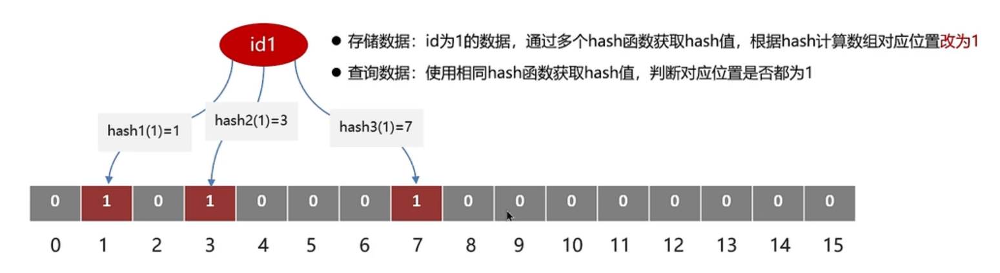
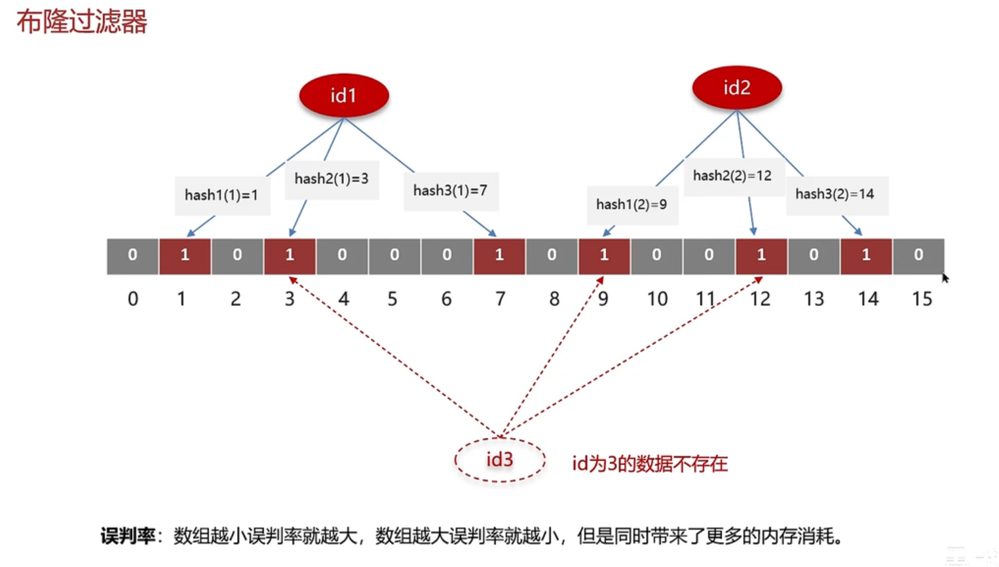
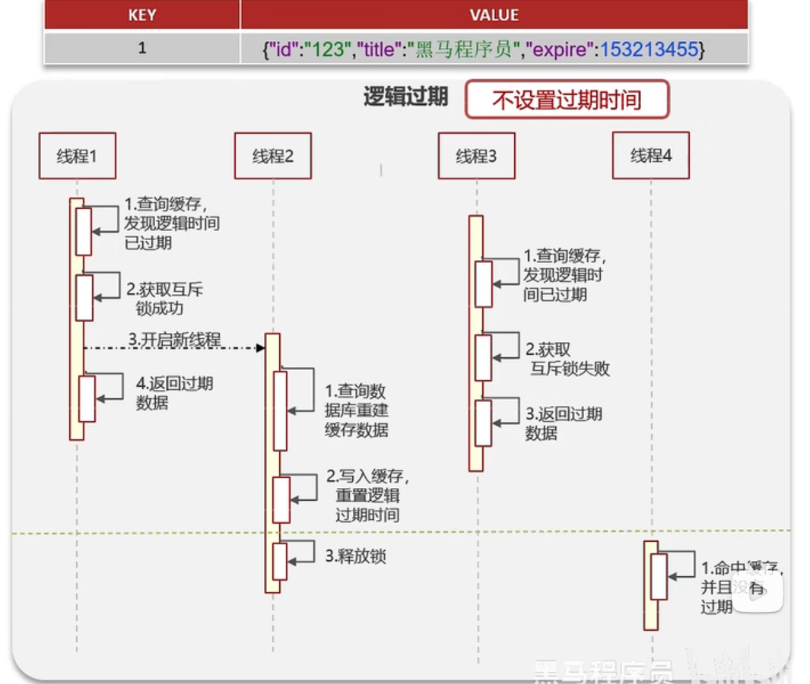
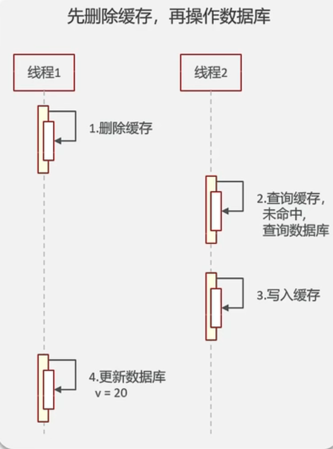
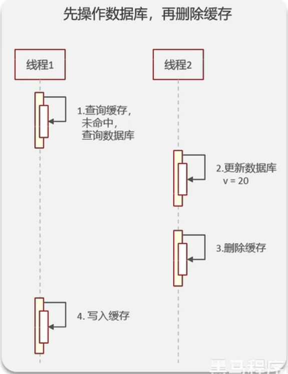
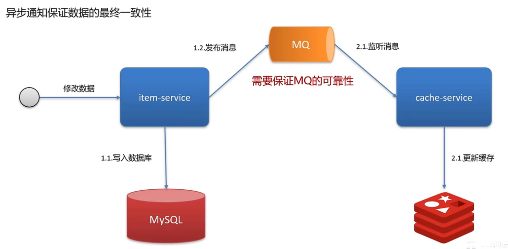
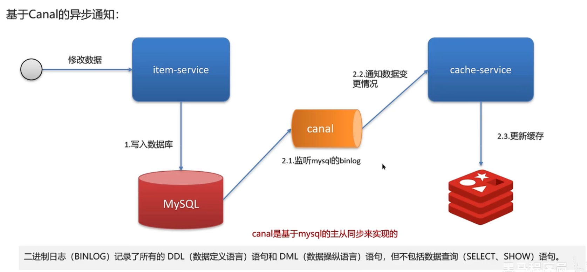
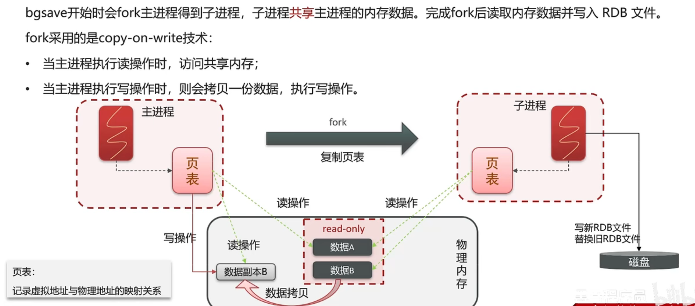

# java八股文学习过程

## 一、Redis

### 使用场景

* 缓存
  * 穿透、击穿、雪崩
  * 双写一致、持久化
  * 数据过期策略、淘汰策略
* 分布式锁
  * setnx redisson
* 计数器
* 保存token
* 消息队列
* 延迟队列

### 缓存

#### 缓存穿透

* 定义
  * 查询一个不存在的数据，mysql查询不到数据也不会写入缓存，就会导致每次请求都查数据库

* 解决方案一
  * 缓存空数据，查询返回的数据为空，仍把这个空结果进行缓存
  * 优点 ***简单***
  * 缺点 ***消耗内存，可能会发生不一致的问题***

* 解决方案二
  * 布隆过滤器
  * 位图：相当于以 ***位(bit)*** 为单位的数字，数组中每个单元只能储存二进制数0或1
  * 作用： 布隆过滤器可以用于检索一个元素是否在一个集合中
  * 优点 ***内存占用小勺，没有多余key***
  * 缺点 ***实现复杂，存在误判***
* 原理


* 误判
  * 数组越大，误判越小，内存消耗越高



#### 缓存击穿

* 定义
  * 在某个key正好过期的时候，有大量对这个key的并发请求过来，这些并发请求可能会瞬间把DB压垮

* 解决方案一
  * 互斥锁
  * 优点 ***强一致性***
  * 缺点 ***性能差***

* 原理


* 解决方案二
  * 逻辑过期
  * 在数据的字段中保存过期时间
  * 优点 ***高可用，性能优***
  * 缺点 ***不能保证数据绝对一致***



#### 缓存雪崩

* 定义
  * 同一时段大量的缓存key同时失效或者Redis服务宕机，导致大量请求到达数据库，带来巨大压力

* 解决方案一
  * 给不同的key的TTL添加随机值

* 解决方案二
  * 利用Redis集群提高服务的可用性 ***哨兵模式 集群模式***

* 解决方案三
  * 给缓存业务添加降级限流策略 ***保底策略，适用于穿透、击穿、雪崩***
  * ngxin 或 spring cloud gateway

* 解决方案四
  * 给业务添加多级缓存
  * Guava 或 Caffeine


#### 双写一致性

* 定义
  * 当修改了数据库的数据也要同时更新缓存的数据，缓存和数据库的数据要保持一致
* 读操作
  * 缓存命中，直接返回；缓存未命中，查询数据库，写入缓存，设定过期时间
* 写操作
  * 延迟双删

* 先删除缓存，再操作数据库
  * 如果有线程在以上两个操作之间读取数据，则会将数据库的更新之前的脏数据写入缓存中，造成双写不一致


* 先操作数据库，再删除缓存
  * 如果有线程在删除缓存之前读到了缓存中的数据，并且在删除缓存后又将脏数据存入了缓存，就会造成双写不一致


* 为什么要延时？
  * 给从数据库同步主数据库的数据的时间

* 绝对保证数据的一致性
  * 加分布式锁

* 读写锁
  * 共享锁：可以读，不可以写
  * 排他锁：不可以读写

* 异步通知保证数据的最终一致性




#### 持久化

* RDB
* 全称为Redis Database Backup file(Redis数据备份文件)，也叫Redis数据快照
  * 在redis控制台输入save，由redis主进程来执行RDB，会阻塞所有命令
  * 在控制台输入bgsave，开启子进程执行RDB，避免主进程受到影响
* 原理
  * 子进程从主进程复制页表，获得虚拟地址对物理地址的映射，写新的RDB文件，替换旧的RDB文件
  * 如果在子进程写新的RDB文件的过程中，主进程又执行RDB操作，则有可能产生脏数据
    * 解决方法：在子进程对物理内存操作时，给对应的数据添加read-only锁，如果主进程有写操作，则从read-only区域拷贝一份数据副本B来操作，如果只是读，则不用拷贝



* AOF
  * 全称为Append Only File(追加文件)，Redis处理的每一个写命令都会记录在AOF文件，可以看作是命令日志文件
  * AOF默认关闭，需要修改redis.conf配置文件来开启AOF


### 2、其他面试题

* 集群
  * 主从
  * 哨兵
  * 集群
* 事务
* redis为什么这么快


## MySQL

### 如何定位慢查询

* 使用工具
  * Arthas
  * Prometheus
  * Skywalking

* 开启MySQL慢查询日志


### SQL执行慢，如何分析

* 使用MySQL自带分析工具EXPLAIN分析


### 索引

* 什么是索引
  * 帮助MySQL高效获取数据的数据结构（有序）

* MySQL的InnoDB引擎采用B+树的数据结构来储存索引
  * 只有叶子节点储存数据，读写代价低
  * 叶子节点是双向链表，便于扫描

* 什么是聚簇索引，什么是非聚簇索引
  * 聚簇索引（聚集索引），索引包含整行的数据
  * 非聚簇索引（二级索引），由数据找到主键的索引

* 什么是回表查询
  * 先用二级索引由数据找到主键，再用聚簇索引由主键找到整行数据

* 什么是覆盖索引
  * 查询一次直接获得所有需要的数据，不需要回表查询的索引，就叫覆盖索引，即查询一次性命中

* MYSQL超大分页怎么处理
  * 覆盖索引+子查询

* 索引创建的原则有哪些
  * ***数据量较大，且查询频繁的表***
  * ***常作为查询条件、排序、分组的字段***
  * 字段内容区分度高
  * 内容较长，使用前缀索引
  * ***尽量使用联合索引***
  * ***要控制索引的数量***
  * 如果索引不能储存NULL值，请在创建表时使用NOT NULL约束它

  * 什么情况下索引会失效？
    * 违反最左前缀法则
    * 如果查询中有一个范围查询，那么范围查询右边的列，不能使用索引
    * 不要在索引列上进行运算操作，索引将失效
    * 字符串不加单引号，索引失效。（类型转换）
    * 以%开头的模糊查询Like，索引失效（注意仅在开头会失效，在结尾不会）

* 谈谈你对sql的优化经验

  * 表的设计优化
    * 设置合适的数值，根据实际情况选择
    * 设置合适的字符串类型，char定长效率高，varchar可变长度，效率偏低

  * SQL语句优化
    * select 语句务必指名字段，避免直接使用 select *
    * SQL语句要避免索引失效的写法
    * 尽量用 union all 替代 union ，后者比前者多一次过滤操作
    * 避免在 where 子句中对字段进行表达式操作
    * join 优化，能用innerjoin就不要使用left join right join，如必须要使用，一定要以小表为驱动（小表在外层），内连接会对两个表进行优化

  * 主从复制，读写分离

  * 分库分表


### 事务

* 事务的特性

  * 原子性
    * 事务是不可分割的最小操作单元，全部成功，或全部失败

  * 一致性
    * 事务完成后所有数据必须保持一致

  * 隔离性
    * 事务在不受外部并发操作影响的独立环境下运行

  * 持久性
    * 事务对数据的改变时永久的


* 并发事务问题

  * 问题
    * 脏读
    * 不可重复读
    * 幻读
  
  * 解决方案：隔离
    * 读未提交 Read Uncommitted
    * 读已提交 Read committed
    * 可重复读 Repeatable Read （默认）
    * 串行化 Serializable

* redo log 和 undo log

  * redo log
    * 记录的是数据页的物理变化，服务宕机时可用来同步数据

  * undo log
    * 记录的时逻辑日志，当事务回滚时，通过逆操作恢复原来的数据

  * redo log 保证事务的持久性，undo log 保证事务的原子性和一致性


### MVCC-多版本并发控制

* 定义
  * 维护一个数据的多个版本，使得读写操作没有冲突

* 隐藏字段
  * trx_id (事务id)，记录每一次操作的事务id，是自增的
  * roll_pointer (回滚指针)，指向上一个版本的事务记录的地址

* undo log
  * 回滚日志，储存老版本数据
  * 版本链：多个事务共同操作某一数据，记录不同数据修改数据的版本，通过roll_pointer指针形成一个链表

* readView
  * 根据readView的匹配规则和当前的一些事务id判断该访问哪个版本的数据
  * 不同隔离级别的快照读不一样，访问的版本不同
    * RC 每一次执行快照读时生成一个readView
    * RR 仅在第一次执行快照读时生成一个readView


### 主从同步原理

* MySQL主从复制的核心就是二进制日志binlog(DDL(数据定义语言)语句和DML(数据操纵语言)语句)
  * 主库在数据提交时，会把数据变更记录在二进制日志文件binlog中
  * 从库读取主库的二进制文件binlog，写入到从库的中继日志文件Relay log中
  * 从库重做中继日志文件中的事件，将改变它自己的数据


### 分库分表

* 水平分 （需要用到sharding-sphere、mycat等中间键）
  * 水平分库
    * 将一个库中的数据分到多个库中，解决海量数据储存和高并发的问题
  * 水平分表
    * 解决单表储存和性能问题

* 垂直分
  * 垂直分库
    * 根据业务进行拆分（类似微服务），高并发下提高磁盘IO和网络连接数
  * 垂直分表
    * 冷热数据分离，多表互不影响


## 框架

### Spring

* Spring框架中的单例bean是线程安全的吗
  * 不是线程安全的

* 什么是AOP
  * 面向切面编程，用于将那些与业务无关的，但却对多个对象产生影响的公共行为和逻辑，抽取公共模块复用，降低耦合

* 在项目中使用AOP的场景
  * 记录操作日志、缓存、spring实现的事务

* Spring中的事务时如何实现的
  * 其本质是通过AOP功能，对方法前后进行拦截，在执行方法前开启事务，在执行完目标方法之后根据执行情况提交或回滚事务


* Spring中事务失效的场景
  * 异常捕获处理，自己处理了异常，没有抛出，无法触发事务回滚
    * 解决方法：手动throw抛出

  * 抛出的异常为检查异常，如FileNotFoundException，无法触发事务回滚
    * 解决方法：配置rollbackFor属性  ```@Transactional(rollbackFor=Exception.class)```
    * 只要抛出异常就会回滚

  * 非public方法，无法触发事务回滚
    * 解决方法：改为public方法


* Spring中bean的生命周期
  * 通过BeanDefinition获取定义Bean的信息
  * 调用构造函数实例化Bean
  * bean的依赖注入
  * 处理Aware接口 (BeanNameAware、BeanFactoryAware、ApplicationContextAware)
  * Bean的前置处理器BeanPostProcessor-before
  * 初始化方法（InitializingBean、init-method）
  * Bean的后置处理器BeanPostProcessor-after
  * 销毁Bean


* Spring中的循环引用
  * 循环依赖：两个或两个以上的Bean互相持有对方，最终形成闭环
  * 循环依赖在Spring中允许存在，Spring框架依据三级缓存解决了大部分依赖问题
    * 一级缓存：单例池
    * 二级缓存：缓存早期的Bean对象（半成品池）
    * 三级缓存：对象工厂池（用以处理代理对象，因为代理对象无法生成半成品）

* 构造方法出现了循环依赖怎么解决
  * 原因：bean的生命周期中，构造函数是第一个执行的，Spring不能解决构造函数的依赖注入
  * 解决方法：使用@Lazy进行懒加载，什么时候需要对象在进行bean对象的创建


    ```
    public A(@Lazy B b){
      System.out.println("A的构造方法执行了...");
      this.b = b;
    }
    ```


* SpringMVC的执行流程

  * 部件
    * 前端控制器 DispatcherServlet
    * 处理器映射器 HandlerMapping
    * 处理器适配器 HandlerAdapter
    * 视图解析器 ViewResolver

  * 流程

    * jsp模式
    * 用户发送请求到前端控制器
    * 前端控制器收到请求，调用处理器映射器
    * 处理器映射器找到处理器，生成处理器对象和处理器拦截器（如果有），一起返回给前端控制器
    * 前端控制器调用处理器适配器
    * 处理器适配器经过适配，调用具体的处理器
    * 处理器执行完成返回模型和视图（ModelAndView）对象
    * 处理器适配器将处理器的执行结果返回给前端控制器
    * 前端控制器将执行结果传给视图解析器
    * 视图解析器解析后返回具体的视图
    * 前端控制器渲染视图
    * 前端控制器用渲染好的视图响应用户

    * 前后端分离模式
    * 调用处理器后将返回结果转换为json并响应


* Springboot自动配置原理

  * 在SpringBoot项目的引导类上有一个注解@SpringBootApplication，这个注解是对三个注解进行了封装，分别是
    * @SpringBootConfiguration
    * @EnableAutoConfiguration
    * @ComponentScan

  * 其中@EnableAutoConfiguration为核心注解，该注解通过@Import导入对应的配置选择器。
  * 选择器内部就是该项目和该项目引用的Jar包的classpath路径下META-INF/spring.factory文件中所配置的类的全类名。
  * 在这些配置类中所定义的Bean会根据条件注解```所指定的条件来决定```是否要将其导入到spring容器中

  * 条件判断会有像@ConditionalOnClass这样的注解，判断是否有对应的class文件，如果有则加载该类，把这个配置类的所有Bean放入spring容器中使用


* Spring的常见注解有哪些

  * @Component   @Controller  @Service  @Repository
    * 使用在类上用于实例化Bean

  * @Autowired
    * 使用在字段上用于根据类型依赖注入

  * @Qualifier
    * 结合@Autowired一起使用用于根据名称进行依赖注入

  * @Scope
    * 标注Bean的作用范围

  * @Configuration
    * 指定当前类是一个Spring配置类，当创建容器时会从该类上加载注解

  * @ComponentScan
    * 用于指定Spring在初始化容器时要扫描的包

  * @Bean
    * 使用在指定方法上，标注将该方法的返回值储存到Spring容器中

  * @Import
    * 使用@Import导入的类会被Spring加载到IOC容器中

  * @Aspect  @Before  @After  @Around  @Pointcut
    * 用于切面编程（AOP）


* SpringMVC的常见注解有哪些

  * @RequestMapping
    * 用于映射请求路径，可以定义在类上和方法上。用于类上，则表示类中的所有方法都是以该地址作为父路径

  * @RequestBody
    * 注解实现接受Http请求的json数据，将json转换为java对象

  * @RequestParam
    * 指定请求参数的名称

  * @PathViriable
    * 从请求路径下获取请求参数(/user/{id})，传递给方法的形式参数

  * @ResponseBody
    * 注解实现将controller方法返回对象转化为json对象响应给客户端

  * @RequestHeader
    * 获取指定的请求头数据

  * @RestController
    * @Controller + @ResponseBody


* SpringBoot的常见注解有哪些

  * @SpringBootConfiguration
    * 组合了@Configuration注解，实现配置文件的功能

  * @EnableAutoConfiguration
    * 打开自动配置的功能，也可以关闭某个自动配置的选项

  * @ComponentScan
    * Spring组件扫描


### MyBatis

* MyBatis执行流程
  * 读取MyBatis配置文件：mybatis-config.xml加载运行环境和映射文件
  * 构造会话工厂SqlSessionFctory
  * 会话工厂创建SqlSession对象（包含了执行SQL语句的所有方法）
  * 操作数据库的接口，Executor执行器，同时负责查询缓存的维护
  * Executor接口的执行方法中有一个MappedStatement类型的参数，封装了映射信息
  * 输入参数映射
  * 输出结果映射


* MyBatis是否支持延迟加载
  * 支持，但默认不开启
  * 延迟加载：需要时再加载，不需要则不加载
  * MyBatis支持一对一关联对象和一对多关联集合对象的延迟加载
  * 再MyBatis配置文件中，可以配置是否启用延迟加载```lazyLoadingEnabled = true | false```，默认时关闭的


* 延迟加载的底层原理
  * 使用CGLIB创建目标对象的代理对象
  * 当调用目标方法时，进入拦截器invoke方法，发现目标方法时null值，执行sql查询
  * 获取数据以后，调用set方法设置属性值，再继续查询目标方法，就有值了


* Mybatis的一级、二级缓存
  * 一级缓存
    * 基于PerpetualCache的HashMap本地缓存，器储存作用域为Session，当Session进行Flush或close之后，该Session中的所有Cache就将清空，默认打开一级缓存
  * 二级缓存
    * 基于namespace和mapper的作用域起作用的，不是依赖于SQL session，默认也是采用PerpetualCache，HashMap储存。需要单独开启，一个是核心配置，一个是mapper映射文件

* Mybatis的二级缓存什么时候会清理缓存中的数据
  * 当某一个作用域（一级缓存Session/二级缓存Namespaces）的进行了```新增、修改、删除```操作后，默认该作用域下所有select中的缓存被clear


### Spring Cloud

* SpringCloud的常见组件有哪些

  * 注册中心
    * Eureka、Nacos（配置中心）

  * 负载均衡
    * Ribbon

  * 远程调用
    * Feign

  * 服务熔断
    * Hystrix、sentinel（服务保护）

  * 服务网关
    * Gateway、Zuul


* SpringCloud如何实现服务注册发现
  * 服务注册： 服务提供者需要把自己的信息注册到eureka，由eureka来保存这些信息，比如服务名称、ip、端口等等
  * 服务发现： 消费者向eureka拉去服务列表信息，如果服务提供者有集群，则消费者会利用负载均衡算法，选择一个发起调用
  * 服务监控： 服务提供者会每隔30妙向eureka发送心跳，报告健康状态，如果eureka服务90妙没就受到心跳，从eureka中剔除


* eureka和nacos的区别

  * 共同点：注册中心
    * 都支持服务注册和服务拉取
    * 都支持服务提供者心跳方式做健康检测

  * 区别：注册中心
    * Nacos支持服务端主动检测提供者状态：临时实例采用心跳模式，非临时实例采用主动检测模式
    * 临时实例心跳不正常会被剔除，非临时实例则不会被剔除
    * Nacos支持服务列表的消息推送模式，服务列表更新更及时
    * Nacos集群默认采用AP方式，档集群中存在非临时实例时，采用CP模式；Eureka采用AP方式

  * Nacos还支持配置中心，eureka则只有注册中心，也是选择Nacos的一个重要原因


* 负载均衡

  * 负载均衡如何实现
    * 使用Ribbon，在使用feign远程调用的过程中，底层的负载均衡使用了ribbon

  * Ribbon负载均衡的策略
    * RoundRobinRule  轮询
    * WeightedResponseTimeRule  权重，响应时间越长，权重越小
    * RandomEule  随机
    * ZoneAvoidanceRule  区域敏感，以Zone对服务器进行分类，在对Zone内的多个服务做轮询

  * 自定义负载均衡
    * 创建类实现IRule接口，可以指定负载均衡策略（全局）
    * 在客户端的配置文件中，可以配置某一个服务调用的负载均衡策略（局部）


* 服务雪崩如何解决
  * 服务雪崩
    * 一个服务失败，导致整条链路的服务都失败
  * 服务降级
    * 服务自我保护的一种方式，确保服务不会收到突增的请求影响变得不可用，一般在世纪开发中与feign接口整合，编写降级逻辑
  * 服务熔断
    * 默认关闭，需要手动打开，如果检测到```10秒内请求的失败率超过50%```，就触发熔断机制。之后```每隔5秒重新尝试请求```微服务，如果微服务不能响应，则继续熔断，直到微服务可达，则回复正常请求


* 微服务怎么监控
  * 使用skywalking监控
    * skywalking主要可以监控接口、福娃五、物理实例的一些状态。特别是在压力测试的时候可以看到众多服务中哪些服务和接口比较慢，可以针对性分析和优化
    * 在skywalking设置了告警规则，如果报错，可以给相关负责人发送消息，第一时间告知项目的bug情况，第一时间修复